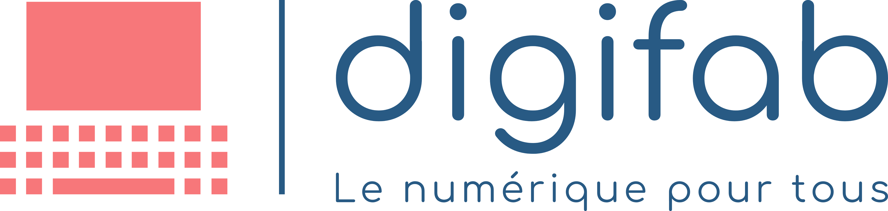

# Code de Conduite

## Introduction

La communauté Digifab s'engage à fournir un espace et une expérience sûrs, inclusifs, accueillants et exempts de harcèlement pour tous les participants de la communauté, indépendamment de l'identité et de l'expression de genre, de l'orientation sexuelle, du handicap, de l'apparence physique, du statut socio-économique, de la taille, de l'ethnicité, de la nationalité, du niveau d'expérience, de l'âge, de la religion (ou de l'absence de religion) ou d'autres marqueurs d'identité. Notre code de conduite existe en raison de ce dévouement, et nous ne tolérons aucune forme de harcèlement.

Si vous ne pouvez pas prendre la peine de le lire en entier, voici un résumé court et agréable : **Soyez un bon humain, soyez gentil et aidez ceux qui ont besoin d'aide. Ce groupe a pour but d'apprendre et d'améliorer nos compétences en tant que communauté afin de nous améliorer. Si cela ne correspond pas à ce dont vous voulez parler, il y a de meilleurs endroits sur Internet où vous pouvez avoir ces discussions**.

Ce code de conduite s'applique à **TOUT LE MONDE** dans **TOUS** les espaces de la communauté Digifab, y compris :

- Le serveur Discord Digifab
- Les dépôts open source de Digifab
- Les événements et rencontres de la communauté Digifab, en ligne et hors ligne.
- Les communications individuelles relatives aux affaires de la Communauté Digifab.

Les participants qui violent notre code de conduite peuvent être pénalisés ou expulsés à la discrétion de la direction de la communauté.

Certains espaces de la communauté Digifab peuvent avoir des règles supplémentaires en place, qui sont affichées publiquement pour les participants. Les participants sont responsables de la connaissance et du respect de ces règles. Nous invitons tous ceux qui participent à la Communauté Digifab à nous aider à instaurer des expériences communautaires sûres et positives.

Les conséquences du non-respect du code de conduite peuvent inclure une discussion avec les modérateurs, une médiation avec le participant que vous avez peut-être harcelé ou, en dernier recours absolu, une interdiction de la communauté.

## Comportement

### Un comportement approprié contribue à la santé, à la sécurité et à la longévité de la communauté Digifab.

- Participer d'une manière authentique et empathique.
- Représenter la communauté Digifab d'une manière positive et professionnelle.
- Utiliser un langage accueillant et inclusif.
- Faire preuve de considération et de respect dans vos paroles et vos actions.
- S'abstenir de tout comportement ou discours dégradant, discriminatoire ou harcelant.
- Être attentif à votre environnement et aux autres participants.
- Considérer ce qui est le mieux pour la communauté.
- Alerter les modérateurs de la communauté si vous remarquez une situation dangereuse, une personne en détresse ou des violations non résolues du présent code de conduite.
- S'abstenir de faire quelque chose que vous ne feriez pas dans une autre situation professionnelle.
- Se rappeler que les lieux où se déroulent les événements communautaires peuvent être partagés avec des membres du public ; être respectueux de tous les usagers de ces lieux.
- Garder un esprit ouvert et curieux sans faire de suppositions sur les autres.
- Tenter la collaboration avant le conflit.
- Accepter de bonne grâce les critiques constructives bien communiquées.

### Le harcèlement ou les comportements inappropriés comprennent

- Le spamming de contenu similaire sur plusieurs canaux et/ou la publication de liens affiliés.
- La publicité et la promotion de la communauté/des produits/des affiliés sont interdites, sauf si elles sont approuvées par un membre de l'équipe de direction.
- Le langage et les actions discriminatoires qui renforcent les structures sociales de domination liées au sexe, à l'identité et à l'expression sexuelles, à l'orientation sexuelle, au handicap, à la maladie mentale, à la neuro(a)typicité, à l'apparence physique, à la taille, à l'âge, à la race, à la religion (ou à l'absence de religion) ou à d'autres marqueurs d'identité.
- Trolling excessif ou perturbation soutenue et non sollicitée.
- Insultes ou attaques personnelles.
- Matériel violent ou objectivant.
- Images ou comportements sexuels gratuits ou hors sujet dans des espaces où ils ne sont pas appropriés.
- Attention sexuelle importune.
- Langage violent ou menaces de violence.
- Incitation à la violence à l'égard de toute personne, y compris l'incitation au suicide ou à l'automutilation.
- Commentaires importuns concernant les choix et les pratiques de vie d'une personne, y compris ceux liés à l'alimentation, à la santé, à l'éducation des enfants, aux drogues et à l'emploi.
- L'utilisation délibérée d'un faux nom ou de noms "morts" ou rejetés.
- Habitude de contacts sociaux inappropriés, comme demander/supposer des niveaux d'intimité non professionnels avec les autres.
- Poursuite de la communication en tête-à-tête après avoir demandé de cesser.
- Divulgation délibérée de tout aspect de l'identité d'une personne sans son consentement.
- Menace de publication ou publication d'informations personnelles identifiables d'autres personnes sans leur consentement.
- Publication de communications privées non harcelantes sans consentement.
- Bloguer, tweeter ou communiquer de toute autre manière avec l'intention de nuire à la réputation de quelqu'un, c'est-à-dire "faire un exemple" d'un participant de la communauté.
- Intimidation, harcèlement ou suivi.
- Prendre des photos ou des enregistrements harcelants ou non désirés, y compris l'enregistrement d'activités en ligne à des fins de harcèlement.
- Toute autre conduite qui pourrait raisonnablement être considérée comme inappropriée dans un cadre professionnel.
- Le fait de préconiser ou d'encourager l'un des comportements susmentionnés.

## Procédure de signalement

Si vous subissez ou êtes témoin (ou avez subi ou été témoin) de violations du code de conduite ou si vous avez d'autres préoccupations, veuillez en informer un membre de l'équipe `Admin` ou `Modérateur` sur Discord, Les rapports de violations du code de conduite doivent inclure autant de détails que possible, par exemple :

- Les pseudos Discord des personnes impliquées
- Quand et sur quel(s) canal(aux) cela s'est produit
- Un résumé détaillé de ce qui s'est passé
- Contexte supplémentaire / captures d'écran

## Mise en application

- Les participants seront invités à cesser tout comportement de harcèlement et devront s'y conformer immédiatement, même s'ils ne sont pas d'accord avec le comportement signalé ou ne le reconnaissent pas entièrement.
- Si un participant enfreint le code de conduite, les modérateurs de la communauté peuvent prendre toute mesure qu'ils jugent appropriée pour maintenir un environnement accueillant pour tous les participants, pouvant aller jusqu'à la suppression des messages, des permissions ou de l'adhésion du participant à la communauté.

## Modérateurs

Les modérateurs du Code de conduite :

- Dans les coulisses, il y aura toujours au moins deux personnes travaillant ensemble pour résoudre les violations.
- Répondre aussi rapidement que possible aux rapports de violations.
- Faire un effort pour comprendre les deux côtés de la situation.
- Se tenir mutuellement responsables.
- Se récuser ou être dispensés de traiter un incident s'ils sont répertoriés comme un possible contrevenant au Code de conduite.
